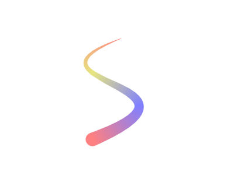
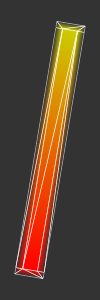
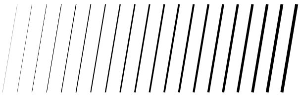
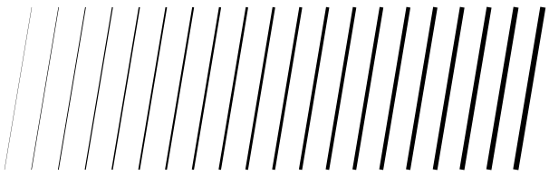
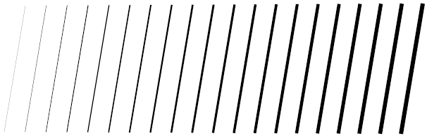
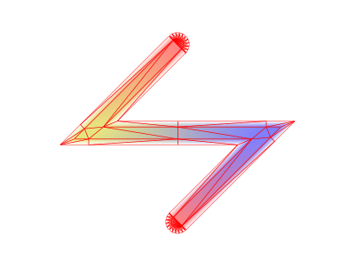

<body>
	

		

			<h1>VASE renderer</h1>
		

<h2>About</h2>

VASE renderer version 0.42 (VASEr 0.42) is a tessellating library for rendering high quality 2D vector graphics. It is an attempt to address unconventional features in 2d graphics. It is intended for OpenGL 1.1+, but much of the code is API independent C++.

<h2>Unconventional features</h2>
<h3>Per vertex coloring and weighting</h3>

  VASEr revolutionarily lets you control the color and thickness at each vertex for a polyline. This feature is unseen on any commonly available graphics library.
	

<h3>Linear gradient along curve</h3>

 A similar feature is also available to curves. Because there are so many vertices on a curve that it is impractical to specify data on each point, VASEr lets you define a linear gradient of color and thickness along the length of a curve, giving you two more degrees of freedom.
	

<h3>Feathering for brush like effects</h3>

 VASEr must use an outsetting polygon anyway, so it is free (as in computational cost) to scale it up, and it is called feathering in VASEr.
	

<h3>Premium quality anti aliasing</h3>

  From left to right: raw polygon without anti aliasing,  
anti aliased with outset fade polygon,  
exaggerated outsetting polygon with wireframe,  
same as left without wireframe.
	

Outset-fade polygon is the high quality, fast, portable, consistent and hassle free technique for anti aliasing. The difficulties are to calibrate the outsetting distance to achieve believable result and to perform tedious tessellation. Luckily VASEr did this for you.

Below are line rendering comparison between VASEr and Cairo and AGG:

	
VASEr 

	
Cairo 

	
AGG 

There is small difference, but it is more a matter of taste than correctness. In terms of clarity VASEr is like between Cairo and AGG, and VASEr is the most crisp among the three. VASEr even do pixel alignment to 1px completely horizontal or vertical lines.

The flaw is, because the outsetting distance is resolution dependent, while the triangulation is unaffected under rotational transformation, fidelity will be lost under scale and sheer.

<h3>Performant</h3>

VASEr is for real time rendering. Tessellation is done on CPU and the triangles are then sent off to GPU for rasterization. VASEr is equally fast regardless of the thickness of lines and the rendering resolution.

Can tessellation be accelerated by GPU? Probably, but I have no plan to do so. The performance enhancement strategy of VASEr is adaptation, that means doing expensive joint processing only when necessary and unperceivablely switch to approximation for thin lines and curves. The decision requires some global information and result in lots of branching, which makes it harder to write GPU programs. But after all, correctness is the first priority and performance is the last.

<h2>"Next generation" 2d graphics?</h2>

Q: Who needs "Per vertex coloring and weighting", "Linear gradient along curve" or "Feathering for brush like effects" in vector graphics? A: Same answer as "who needs typesetting and beautiful fonts on their computers?".

Q: These effects can be achieved by vector graphics package XXX using tool AAA then effect BBB, so who needs VASE renderer? A: Arguably true. But the fundamental change is <b>making vertex a three dimensional entity</b> (position, color, weight), and to <b>supercharge the intrinsic properties of strokes</b>. The idea is, it should be <i>natural</i> to apply colors and thickness to a stroke.

<h2>Status</h2>

VASEr is production ready for conventional use. The unconventional features are largely usable for normal circumstances, but may have defects at extreme cases. In particular, varying thickness is undesirable at acute angles and when weight difference is large. So it is not bullet proof yet. The tessellation code is tediously written for each point for each triangle for each circumstance, because a general outsetting and tessellating algorithm is doomed to be slow.

Currently VASEr is only a programming library and is not used in any vector graphics tool. I do have a plan (a plan only) to develop associated tools.

In any case, sending me any form of encouragement (e.g. great work, thank you, donation) will help.

<h2>Documentation</h2>

	<a href='docs/getting_started.html'>getting started</a> 
	<a href='docs/API.html'>API reference</a> 
	Articles 
	<a href='http://artgrammer.blogspot.com/2011/07/drawing-polylines-by-tessellation.html' target='_blank'>Drawing polylines by tessellation.</a> 
	<a href='http://artgrammer.blogspot.hk/2011/05/drawing-nearly-perfect-2d-line-segments.html'>Drawing nearly perfect 2D line segments in OpenGL</a>

<h2>License</h2>

VASE renderer version 0.42 (VASEr 0.42) is licensed under The 3-Clause BSD License.

Copyright (2011-2016) Tsang Hao Fung (Chris Tsang) tyt2y3@gmail.com

Redistribution and use in source and binary forms, with or without modification, are permitted provided that the following conditions are met:

1. Redistributions of source code must retain the above copyright notice, this list of conditions and the following disclaimer.

2. Redistributions in binary form must reproduce the above copyright notice, this list of conditions and the following disclaimer in the documentation and/or other materials provided with the distribution.

3. Neither the name of the copyright holder nor the names of its contributors may be used to endorse or promote products derived from this software without specific prior written permission.

THIS SOFTWARE IS PROVIDED BY THE COPYRIGHT HOLDERS AND CONTRIBUTORS "AS IS" AND ANY EXPRESS OR IMPLIED WARRANTIES, INCLUDING, BUT NOT LIMITED TO, THE IMPLIED WARRANTIES OF MERCHANTABILITY AND FITNESS FOR A PARTICULAR PURPOSE ARE DISCLAIMED. IN NO EVENT SHALL THE COPYRIGHT HOLDER OR CONTRIBUTORS BE LIABLE FOR ANY DIRECT, INDIRECT, INCIDENTAL, SPECIAL, EXEMPLARY, OR CONSEQUENTIAL DAMAGES (INCLUDING, BUT NOT LIMITED TO, PROCUREMENT OF SUBSTITUTE GOODS OR SERVICES; LOSS OF USE, DATA, OR PROFITS; OR BUSINESS INTERRUPTION) HOWEVER CAUSED AND ON ANY THEORY OF LIABILITY, WHETHER IN CONTRACT, STRICT LIABILITY, OR TORT (INCLUDING NEGLIGENCE OR OTHERWISE) ARISING IN ANY WAY OUT OF THE USE OF THIS SOFTWARE, EVEN IF ADVISED OF THE POSSIBILITY OF SUCH DAMAGE.

Bezier curve subdivision code is extracted from Anti-Grain Geometry V2.4 Copyright 2002-2005 Maxim Shemanarev (McSeem) [Modified BSD License]

</body>
